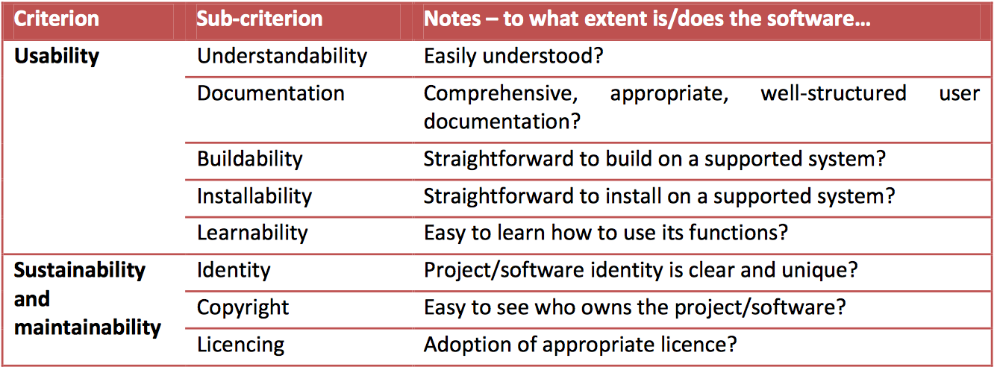
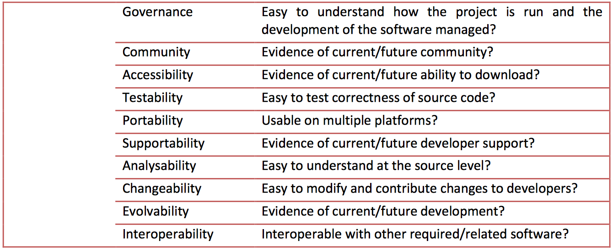

# Final Resume 

# 1. User Interfaces in the Real World

### Quotes about design

> Design is not just about how something looks, But how it works. I don't see a difference between a designer and an engineer, and I don't want to see a difference. A design should be both 
> - Dyson

> An object should be judged by wheter it has a form consistent with its use
>  - Burno Munari

> Design can empower or sidempower us in the most other aspects of our lives. When deployed wisely, it can bring us pleasure, chouce, strength, beauty, comfort, decency, sensitivity, integrity, prosperity, diversity and so much more. But if its power is abused, the outcome can be wastefuk, confusing, humiliating, sacary, enraging even dangerous
> - Alice Rawsthorn

### Form vs Function
Form follows function is a principle associated with modernist architecture and industrial design in the 20th century. The principle is that the shape of a building or object should be primarily based upon its intended function or purpose.

## Seven stages of action [Action Ladder]

Seven stages of action is a term coined by the usability consultant Donal Norman.
### Execution Stages
Execution formally means to perform or do something. Norman explains that a person sitting on an armchair while reading a book at dusk, might need more light when it becomes dimmer and dimmer. To do that, he needs to switch on the button of a lamp i.e. get more light (the goal). To do this, one must need to specify on how to move one's body, how to stretch to reach the light switch and how to extend one's finger to push the button. The goal has to be translated into an intention, which in turn has to be made into an action sequence.
* Goal
    * Start at the top with a **goal**, the state that is to be achieved.
* Intention
    * The goal is translated into a **intention** to do some action.
* Specifying Action
    * The intention must be translated into a set of internal commnads, an **action sequence** that can be performed to satisfy the intention.
* Executing Action
    * The action sequence is still a mutual event: nothing happens until it is **executed**, performed upon the world.

### Evaluation Stages

Evaluation formally means to examine and calculate. Norman explains that after turning on the light, we evaluate if it is actually turned on. A careful judgement is then passed on how the light has affected our world i.e. the room in which the person is sitting on the armchair while reading a book.

* Perceiving the state of the world
* Interpreting the state of the world
* Evaluating the outcome
    * Compare (evaluate) with respect to both our intentions and our goals.

## What drives design?
* Curiosity
* Frustation Emotion
* Innovation

> It doesn't matter what you think. It matter  what the person who [filled] them thinks
> - Donald Norman

### Ask!

* Who? Who is using whatever I'm designing?
* What? What type of experience do they have?
* Why? Thy are they using it (i.e., tasks/goals)?
* When? Does order matter?
* Where? Where should item A go?
* How? How do they expect the thing to work?
    
## Empathy Emotion

## User Centred Design (UCD)
User-centered design (UCD) is a process (not restricted to interfaces or technologies) in which the needs, wants, and limitations of end users of a product, service or process are given extensive attention at each stage of the design process. User-centered design can be characterized as a multi-stage problem solving process that not only requires designers to analyse and foresee how users are likely to use a product, but also to test the validity of their assumptions with regard to user behaviour in real world tests with actual users. Such testing is necessary as it is often very difficult for the designers of a product to understand intuitively what a first-time user of their design experiences, and what each user's learning curve may look like.

The chief difference from other product design philosophies is that user-centered design tries to optimize the product around how users can, want, or need to use the product, rather than forcing the users to change their behavior to accommodate the product.
### Elements of UCD
* Visibility
    Visibility helps the user construct a mental model of the document. Models help the user predict the effect(s) of their actions while using the document. Important elements (such as those that aid navigation) should be emphatic. Users should be able to tell from a glance what they can and cannot do with the document.

* Accessibility
    Users should be able to find information quickly and easily throughout the document, regardless of its length. Users should be offered various ways to find information (such as navigational elements, search functions, table of contents, clearly labeled sections, page numbers, color-coding, etc.). Navigational elements should be consistent with the genre of the document. ‘Chunking’ is a useful strategy that involves breaking information into small pieces that can be organized into some type meaningful order or hierarchy. The ability to skim the document allows users to find their piece of information by scanning rather than reading. Bold and italic words are often used.

* Legibility
    Text should be easy to read: Through analysis of the rhetorical situation, the designer should be able to determine a useful font style. Ornamental fonts and text in all capital letters are hard to read, but italics and bolding can be helpful when used correctly. Large or small body text is also hard to read. (Screen size of 10-12 pixel sans serif and 12-16 pixel serif is recommended.) High figure-ground contrast between text and background increases legibility. Dark text against a light background is most legible.

* Language
    Depending on the rhetorical situation, certain types of language are needed. Short sentences are helpful, as are well-written texts used in explanations and similar bulk-text situations. Unless the situation calls for it, jargon or technical terms should not be used. Many writers will choose to use active voice, verbs (instead of noun strings or nominals), and simple sentence structure.

### Rhetorical Situation
A user-centered design is focused around the rhetorical situation. The rhetorical situation shapes the design of an information medium. There are three elements to consider in a rhetorical situation: Audience, Purpose, and Context.

* Audience
    The audience is the people who will be using the document. The designer must consider their age, geographical location, ethnicity, gender, education, etc.
* Purpose
    The purpose is what the document targets or what problem the document is trying to address.
* Context 
    The context is thecircumstances surrounding the situation. The context often answers the qeustion: What situation has prompted the need for this document? Context also includes any social or cultural issues that may surround the situation.

### Analysis tools used in user-centered design
There are a number of tools that are used in the analysis of user-centered design, mainly: personas, scenarios, and essential use cases.

#### Persona
During the UCD process, a Persona representing the user may be created. It is a fictional character with all the characteristics of the user. Personas are created after the field research process, which typically consists of members of the primary stakeholder (user) group being observed on their behaviour, and additionally answering questionnaires or participating in interviews, or a mixture of both. After results are gathered from the field research, they are used to create personas of the primary stakeholder group.

Often, there may be several personas concerning the same group of individuals, since it is almost impossible to apply all the characteristics of the stakeholder group onto one character. The character depicts a "typical" stakeholder, not an "average" individual in the primary stakeholder group, and is referred to throughout the entire design process.There are also what's called a secondary persona, where the character is not a member of the primary stakeholder group and is not the main target of the design, but their needs should be met and problems solved if possible. They exist to help account for further possible problems and difficulties that may occur even though the primary stakeholder group is satisfied with their solution. There is also an anti-persona, which is the character which the design process is not made for. Personas usually include a name and picture, demographics, roles and responsibilities, goals and tasks, motivations and needs, environment and context, and a quote that can represent the character's personality.

Personas are useful in the sense that they create a common shared understanding of the user group for which the design process is built around. Also, they help to prioritize the design considerations by providing a context of what the user needs and what functions are simply nice to add and have. They can also provide a human face and existence to a diversified and scattered user group, and can also create some empathy and add emotions when referring to the users. However, since personas are a generalized perception of the primary stakeholder group from collected data, the characteristics may be too broad and typical, or too much of an "average joe". Sometimes, personas can have stereotypical properties also, which may hurt the entire design process. Overall, personas can be a useful tool to be used by designers to make informed design decisions around, opposed to referring to a set of data or a wide range of individuals.

#### Scenario
A scenario created in the UCD process is a fictional story about the "daily life of" or a sequence of events with the primary stakeholder group as the main character. Typically, a persona that was created earlier is used as the main character of this story. The story should be specific of the events happening that relate to the problems of the primary stakeholder group, and normally the main research questions the design process is built upon. These may turn out to be a simple story about the daily life of an individual, but small details from the events should imply details about the users, and may include emotional or physical characteristics. There can be the "best-case scenario", where everything works out best for the main character, the "worst-case scenario", where the main character experiences everything going wrong around him or her, and an "average-case scenario", which is the typical life of the individual, where nothing really special or really depressing occurs, and the day just moves on.

Scenarios create a social context in which the personas exist, and also create an actual physical world, instead of imagining a character with internal characteristics from gathered data and nothing else; there is more action involved in the persona's existence. A scenario is also more easily understood by people, since it is in the form of a story, and is easier to follow. Yet, like the personas, these scenarios are assumptions made by the researcher and designer, and is also created from a set of organized data. Some even say such scenarios are unrealistic to real life occurrences. Also, it is difficult to explain and inform low level tasks that occur, like the thought process of the persona before acting.

#### Use Case
In short, a use case describes the interaction between an individual and the rest of the world. Each use case describes an event that may occur for a short period of time in real life, but may consist of intricate details and interactions between the actor and the world. It is represented as a series of simple steps for the character to achieve his or her goal, in the form of a cause-and effect scheme. Use cases are normally written in the form of a chart with two columns: first column labelled actor, second column labelled world, and the actions performed by each side written in order in the respective columns. The following is an example of a use case for performing a song on a guitar in front of an audience.

|Actor|World|
|---|----|
|choose music to play||
|pick up guitar||
|| display sheet musici|
|perform each note on sheet music using guitar||
||convey note to audience using sound|
||audience provides feedpack to performer|
|assess performance and adjust as needed based on audience feedback.||
|complete song with required adjustments||
||audience applause|

The interaction between actor and the world is an act that can be seen in everyday life, and we take them as granted and don't think too much about the small detail that needs to happen in order for an act like performing a piece of music to exist. It is similar to the fact that when speaking our mother tongue, we don't think too much about grammar and how to phrase words; they just come out since we are so used to saying them. The actions between an actor and the world, notably, the primary stakeholder (user) and the world in this case, should be thought about in detail, and hence use cases are created to understand how these tiny interactions occur.

An essential use case is a special kind of use case, also called an "abstract use case." Essential use cases describe the essence of the problem, and deals with the nature of the problem itself. While writing use cases, no assumptions about unrelated details should be made. In additions, the goals of the subject should be separated from the process and implementation to reach that particular goal. Below is an example of an essential use case with the same goal as the former example.

### User-centered design, needs and emotions

The book "The Design of Everyday Things" (originally called "The Psychology of Everyday Things") was first published in 1986. In this book, Donald A. Norman describes the psychology behind what he deems 'good' and 'bad' design through examples and offers principles of 'good' design. He exalts the importance of design in our everyday lives, and the consequences of errors caused by bad designs.

In his book, Norman uses the term "user-centered design" to describe design based on the needs of the user, leaving aside what he considers secondary issues like aesthetics. User-centered design involves simplifying the structure of tasks, making things visible, getting the mapping right, exploiting the powers of constraint, and designing for error. Norman's overly reductive approach in this text was readdressed by him later in his own publication "Emotional Design."

Other books in a similar vein include "Designing Pleasurable Products" by Patrick W. Jordan, in which the author suggests that different forms of pleasure should be included in a user-centered approach in addition to traditional definitions of usability.

|Actor|World|
|---|---|
|Choose sheet musica to perform||
|Gather necesasry resources||
||provides access to resources|
|Performs piec sequentially ||
||convey and interprets performance|
||provides feedback|
|completes performance||

> Use cases are useful because they help identify useful levels of design work. They allow the designers to see the actual low level processes that are involved for a certain problem, which makes the problem easier to handle, since certain minor steps and details the user makes are exposed. The designers' job should take into consideration of these small problems in order to arrive at a final solution that works. Another way to say this is that use cases breaks a complicated task into smaller bits, where these bits are useful units. Each bit completes a small task, which then builds up to the final bigger task. Like writing code on a computer, it is easier to write the basic smaller parts and make them work first, and then put them together to finish the larger more complicated code, instead to tackling the entire code from the very beginning.

The first solution is less risky because if something goes wrong with the code, it is easier to look for the problem in the smaller bits, since the segment with the problem will be the one that does not work, while in the latter solution, the programmer may have to look through the entire code to search for a single error, which proves time consuming. The same reasoning goes for writing use cases in UCD. Lastly, use cases convey useful and important tasks where the designer can see which one are of higher importance than others. Some drawbacks of writing use cases include the fact that each action, by the actor or the world, consist of little detail, and is simply a small action. This may possibly lead to further imagination and different interpretation of action from different designers.

Also, during the process, it is really easy to oversimplify a task, since a small task from a larger task may consist of even smaller tasks. Picking up a guitar may involve thinking of which guitar to pick up, which pick to use, and think about where the guitar is located first. These tasks may then be divided into smaller tasks, such as first thinking of what colour of guitar fits the place to perform the piece, and other related details. Tasks may be split further down into even tinier tasks, and it is up to the designer to determine what is a suitable place to stop splitting up the tasks.[8] Tasks may not only be oversimplified, they may also be omitted in whole, thus the designer should be aware of all the detail and all the key steps that are involved in an event or action when writing use cases.

### User-centered design in product lifecycle management systems
Software applications (or often suites of applications) used in product lifecycle management (typically including CAD, CAM and CAx processes) can be typically characterized by the need for these solutions to serve the needs of a broad range of users, with each user having a particular job role and skill level. For example, a CAD digital mockup might be utilized by a novice analyst, design engineer of moderate skills, or a manufacturing planner of advanced skills.

## UX

User Experience (UX) involves a person's behaviors, attitudes, and emotions about using a particular product, system or service.

User experience includes the practical, experiential, affective, meaningful and valuable aspects of human–computer interaction and product ownership. Additionally, it includes a person’s perceptions of system aspects such as utility, ease of use and efficiency. User experience may be considered subjective in nature to the degree that it is about individual perception and thought with respect to the system. User experience is dynamic as it is constantly modified over time due to changing usage circumstances and changes to individual systems as well as the wider usage context in which they can be found.

### Definitions
The international standard on ergonomics of human system interaction, ISO 9241-210,defines user experience as "a person's perceptions and responses that result from the use or anticipated use of a product, system or service". According to the ISO definition, user experience includes all the users' emotions, beliefs, preferences, perceptions, physical and psychological responses, behaviors and accomplishments that occur before, during and after use. The ISO also list three factors that influence user experience: system, user and the context of use.

Note 3 of the standard hints that usability addresses aspects of user experience, e.g. "usability criteria can be used to assess aspects of user experience". The standard does not go further in clarifying the relation between user experience and usability. Clearly, the two are overlapping concepts, with usability including pragmatic aspects (getting a task done) and user experience focusing on users’ feelings stemming both from pragmatic and hedonic aspects of the system. Many practitioners use the terms interchangeably. The term usability pre-dates the term user experience. Part of the reason the terms are often used interchangeably is that, as a practical matter, a user will at minimum require sufficient usability to accomplish a task, while the feelings of the user may be less important, even to the user herself. Since usability is about getting a task done, aspects of user experience like information architecture and user interface can help or hinder a user's experience. If a website has "bad" information architecture and a user has a difficult time finding what they are looking for, then a user will not have an effective, efficient and satisfying search.

In addition to the ISO standard, there exist several other definitions for user experience. Some of them have been studied by Law et al.

According to Jim Miller, principal of Miramontes Computing, user experience "encompasses much more than the traditional 'user interface' issues, such as screen design and command structure. Rather, it's a broad collection of user-centric issues that cut through the full extent of a project."

### Influences on user experience

Many factors can influence a user's experience with a system. To address the variety, factors influencing user experience have been classified into three main categories: user's state and previous experience, system properties, and the usage context (situation).Studying typical users, contexts, interactions and resulting emotions help in designing the system.

### Momentary emotion or overall user experience

Single experiences influence the overall user experience: the experience of a key click affects the experience of typing a text message, the experience of typing a message affects the experience of text messaging, and the experience of text messaging affects the overall user experience with the phone. The overall user experience is not simply a sum of smaller interaction experiences, because some experiences are more salient than others. Overall user experience is also influenced by factors outside the actual interaction episode: brand, pricing, friends' opinions, reports in media, etc.

One branch in user experience research focuses on emotions. This includes momentary experiences during interaction: designing affective interaction and evaluating emotions. Another branch is interested in understanding the long-term relation between user experience and product appreciation. The industry sees good overall user experience with a company's products as critical for securing brand loyalty and enhancing the growth of customer base. All temporal levels of user experience (momentary, episodic, and long-term) are important, but the methods to design and evaluate these levels can be very different.

## UX [NIELSEN]

The first requirement for an exemplary user experience is to meet the exact needs of the customer, without fuss or bother. Next comes simplicity and elegance that produce products that are a joy to own, a joy to use. True user experience goes far beyond giving customers what they say they want, or providing checklist features. In order to achieve high-quality user experience in a company's offerings there must be a seamless merging of the services of multiple disciplines, including engineering, marketing, graphical and industrial design, and interface design.

It's important to distinguish the total user experience from the user interface (UI), even though the UI is obviously an extremely important part of the design. As an example, consider a website with movie reviews. Even if the UI for finding a film is perfect, the UX will be poor for a user who wants information about a small independent release if the underlying database only contains movies from the major studios.

We should also distinguish UX and usability: According to the definition of usability, it is a quality attribute of the UI, covering whether the system is easy to learn, efficient to use, pleasant, and so forth. Again, this is very important, and again total UX is an even broader concept.

## Usability
### Rules of Thumb
* Visibility
* Language
* Control and Freedom
* Standards
* Error Prevention
* Recognition
* Flexible
* Minimalist
* Ownership
* Document

### Survivor Bias
Survivorship bias, or survival bias, is the logical error of concentrating on the people or things that "survived" some process and inadvertently overlooking those that did not because of their lack of visibility. This can lead to false conclusions in several different ways. The survivors may be actual people, as in a medical study, or could be companies or research subjects or applicants for a job, or anything that must make it past some selection process to be considered further.

Survivorship bias can lead to overly optimistic beliefs because failures are ignored, such as when companies that no longer exist are excluded from analyses of financial performance. It can also lead to the false belief that the successes in a group have some special property, rather than just coincidence. For example, if three of the five students with the best college grades went to the same high school, that can lead one to believe that the high school must offer an excellent education. This could be true, but the question cannot be answered without looking at the grades of all the other students from that high school, not just the ones who "survived" the top-five selection process.

### Confirmation Bias
In psychology and cognitive science, confirmation bias (or confirmatory bias) is a tendency to search for or interpret information in a way that confirms one's preconceptions, leading to statistical errors.
Confirmation bias is a type of cognitive bias and represents an error of inductive inference toward confirmation of the hypothesis under study.
Confirmation bias is a phenomenon wherein decision makers have been shown to actively seek out and assign more weight to evidence that confirms their hypothesis, and ignore or underweigh evidence that could disconfirm their hypothesis.
As such, it can be thought of as a form of selection bias in collecting evidence.

# 2. Screen Design & UI History

## User Interface

The user interface, in the industrial design field of human–machine interaction, is the space where interactions between humans and machines occur. The goal of this interaction is to allow effective operation and control of the machine from the human end, whilst the machine simultaneously feeds back information that aids the operators decision making process. Examples of this broad concept of user interfaces include the interactive aspects of computer operating systems, hand tools, heavy machinery operator controls, and process controls. The design considerations applicable when creating user interfaces are related to or involve such disciplines as ergonomics and psychology.

#### Goal

Generally, the goal of user interface design is to produce a user interface which makes it easy (self explanatory), efficient, and enjoyable (user friendly) to operate a machine in the way which produces the desired result. This generally means that the operator needs to provide minimal input to achieve the desired output, and also that the machine minimizes undesired outputs to the human.

With the increased use of personal computers and the relative decline in societal awareness of heavy machinery, the term user interface is generally assumed to mean the graphical user interface, while industrial control panel and machinery control design discussions more commonly refer to human-machine interfaces.

Other terms for user interface include human–computer interface and man–machine interface (MMI).

#### History

The history of user interfaces can be divided into the following phases according to the dominant type of user interface:

##### 1945–1968: Batch interface

In the batch era, computing power was extremely scarce and expensive. User interfaces were rudimentary. Users had to accommodate computers rather than the other way around; user interfaces were considered overhead, and software was designed to keep the processor at maximum utilization with as little overhead as possible.

The input side of the user interfaces for batch machines were mainly punched cards or equivalent media like paper tape. The output side added line printers to these media. With the limited exception of the system operator's console, human beings did not interact with batch machines in real time at all.

Submitting a job to a batch machine involved, first, preparing a deck of punched cards describing a program and a dataset. Punching the program cards wasn't done on the computer itself, but on specialized typewriter-like machines that were notoriously balky, unforgiving, and prone to mechanical failure. The software interface was similarly unforgiving, with very strict syntaxes meant to be parsed by the smallest possible compilers and interpreters.

Once the cards were punched, one would drop them in a job queue and wait. Eventually. operators would feed the deck to the computer, perhaps mounting magnetic tapes to supply another dataset or helper software. The job would generate a printout, containing final results or (all too often) an abort notice with an attached error log. Successful runs might also write a result on magnetic tape or generate some data cards to be used in later computation.

The turnaround time for a single job often spanned entire days. If one were very lucky, it might be hours; real-time response was unheard of. But there were worse fates than the card queue; some computers actually required an even more tedious and error-prone process of toggling in programs in binary code using console switches. The very earliest machines actually had to be partly rewired to incorporated program logic into themselves, using devices known as plugboards.

Early batch systems gave the currently running job the entire computer; program decks and tapes had to include what we would now think of as operating-system code to talk to I/O devices and do whatever other housekeeping was needed. Midway through the batch period, after 1957, various groups began to experiment with so-called “load-and-go” systems. These used a monitor program which was always resident on the computer. Programs could call the monitor for services. Another function of the monitor was to do better error checking on submitted jobs, catching errors earlier and more intelligently and generating more useful feedback to the users. Thus, monitors represented a first step towards both operating systems and explicitly designed user interfaces.

##### 1969–present: Command-line user interface

Command-line interfaces (CLIs) evolved from batch monitors connected to the system console. Their interaction model was a series of request-response transactions, with requests expressed as textual commands in a specialized vocabulary. Latency was far lower than for batch systems, dropping from days or hours to seconds. Accordingly, command-line systems allowed the user to change his or her mind about later stages of the transaction in response to real-time or near-real-time feedback on earlier results. Software could be exploratory and interactive in ways not possible before. But these interfaces still placed a relatively heavy mnemonic load on the user, requiring a serious investment of effort and learning time to master.[8]

The earliest command-line systems combined teleprinters with computers, adapting a mature technology that had proven effective for mediating the transfer of information over wires between human beings. Teleprinters had originally been invented as devices for automatic telegraph transmission and reception; they had a history going back to 1902 and had already become well-established in newsrooms and elsewhere by 1920. In reusing them, economy was certainly a consideration, but psychology and the Rule of Least Surprise mattered as well; teleprinters provided a point of interface with the system that was familiar to many engineers and users.

The widespread adoption of video-display terminals (VDTs) in the mid-1970s ushered in the second phase of command-line systems. These cut latency further, because characters could be thrown on the phosphor dots of a screen more quickly than a printer head or carriage can move. They helped quell conservative resistance to interactive programming by cutting ink and paper consumables out of the cost picture, and were to the first TV generation of the late 1950s and 60s even more iconic and comfortable than teleprinters had been to the computer pioneers of the 1940s.

Just as importantly, the existence of an accessible screen — a two-dimensional display of text that could be rapidly and reversibly modified — made it economical for software designers to deploy interfaces that could be described as visual rather than textual. The pioneering applications of this kind were computer games and text editors; close descendants of some of the earliest specimens, such as rogue(6), and vi(1), are still a live part of Unix tradition.

##### 1985: S.A.A. User Interface or Text-Based User Interface
n 1985, with the beginning of Windows and other GUI, IBM created what is called the Standard Application Architecture standard which include the C.U.A. (Common User Access) derivative. C.U.A. successfully created what we know and use today in Windows, and most of the more recent DOS or Windows Console Applications will use that standard as well.

This defined that a pulldown menu system should be at the top of the screen, status bar at the bottom, shortcut keys should stay the same for all common functionality (F2 to Open for example would work in all applications that followed the S.A.A. standard). This greatly helped the speed at which users could learn an application so it caught on quick and became an industry standard.[9]

##### 1968–present: Graphical User Interface

* 1968 – Doug Engelbart demonstrated NLS, a system which uses a mouse, pointers, hypertext, and multiple windows.
* 1970 – Researchers at Xerox Palo Alto Research Center (many from SRI) develop WIMP paradigm (Windows, Icons, Menus, Pointers)[10]
* 1973 – Xerox Alto: commercial failure due to expense, poor user interface, and lack of programs[10]
* 1979 – Steve Jobs and other Apple engineers visit Xerox. Pirates of Silicon Valley dramatizes the events, but Apple had already been working on the GUI before the visit
* 1981 – Xerox Star: focus on WYSIWYG. Commercial failure (25K sold) due to expense (16K each), performance (minutes to save a file, couple of hours to recover from crash), and poor marketing
* 1984 – Apple Macintosh popularizes the GUI. Super Bowl commercial shown once, most expensive ever made at that time
* 1984 – MIT’s X Window System: hardware- independent platform and networking protocol for developing GUIs on UNIX-like systems
* 1985 – Windows 1.0 – provided GUI interface to MS-DOS. No overlapping windows (tiled instead).
* 1985 – Microsoft and IBM start work on OS/2 meant to eventually replace MS-DOS and Windows
* 1986 – Apple threatens to sue Digital Research because their GUI desktop looked too much like Apple’s Mac.
* 1987 – Windows 2.0 – Overlapping and resizable windows, keyboard and mouse enhancements
* 1987 – Macintosh II: first full-color Mac
* 1988 – OS/2 1.10 Standard Edition (SE) has GUI written by Microsoft, looks a lot like Windows 2

### UI Types
 **Graphical user interfaces (GUI)** accept input via devices such as a computer keyboard and mouse and provide articulated graphical output on the computer monitor. There are at least two different principles widely used in GUI design: Object-oriented user interfaces (OOUIs) and application oriented interfaces.

 **Command line interfaces**,where the user provides the input by typing a command string with the computer keyboard and the system provides output by printing text on the computer monitor. Used by programmers and system administrators, in engineering and scientific environments, and by technically advanced personal computer users.

 **Batch interfaces** are non-interactive user interfaces, where the user specifies all the details of the batch job in advance to batch processing, and receives the output when all the processing is done. The computer does not prompt for further input after the processing has started.
## Graphical User Interface (GUI)
In computing, a graphical user interface (GUI, sometimes pronounced "gooey" or "jee-you-eye") is a type of interface that allows users to interact with electronic devices through graphical icons and visual indicators such as secondary notation, as opposed to text-based interfaces, typed command labels or text navigation. GUIs were introduced in reaction to the perceived steep learning curve of command-line interfaces (CLIs), which require commands to be typed on the keyboard.
The actions in a GUI are usually performed through direct manipulation of the graphical elements. In addition to computers, GUIs can be found in hand-held devices such as MP3 players, portable media players, gaming devices and smaller household, office and industry equipment. The term "GUI" tends not to be applied to other low-resolution types of interfaces with display resolutions, such as video games (where HUD is preferred), or not restricted to flat screens, like volumetric displays because the term is restricted to the scope of two-dimensional display screens able to describe generic information, in the tradition of the computer science research at the PARC (Palo Alto Research Center).
## GUI Components
> * Predefined
> * Choice
> * Control
> * Cue

A GUI uses a combination of technologies and devices to provide a platform that the user can interact with, for the tasks of gathering and producing information.

A series of elements conforming a visual language have evolved to represent information stored in computers. This makes it easier for people with few computer skills to work with and use computer software. The most common combination of such elements in GUIs is the WIMP ("window, icon, menu, pointing device") paradigm, especially in personal computers.

The WIMP style of interaction uses a virtual input device to control the position of a pointer, most often a mouse, and presents information organized in windows and represented with icons. Available commands are compiled together in menus, and actions are performed making gestures with the pointing device. A window manager facilitates the interactions between windows, applications, and the windowing system. The windowing system handles hardware devices such as pointing devices and graphics hardware, as well as the positioning of the pointer.

In personal computers, all these elements are modeled through a desktop metaphor, to produce a simulation called a desktop environment in which the display represents a desktop, upon which documents and folders of documents can be placed. Window managers and other software combine to simulate the desktop environment with varying degrees of realism.

### GUI Types

#### OOUI
**OOUI = Object Oriented User Interface (think Photoshop)**
n computing an object-oriented user interface (OOUI) is a type of user interface based on an object-oriented programming metaphor. In an OOUI, the user interacts explicitly with objects that represent entities in the domain that the application is concerned with. Many vector drawing applications, for example, have an OOUI - the objects being lines, circles and canvases. The user may explicitly select an object, alter its properties (such as size or colour), or invoke other actions upon it (such as to move, copy, or re-align it). If a business application has any OOUI, the user may be selecting and/or invoking actions on objects representing entities in the business domain such as customers, products or orders.

**Jakob Nielsen** defines the OOUI in contrast to function-oriented interfaces: "Object-oriented interfaces are sometimes described as turning the application inside-out as compared to function-oriented interfaces. The main focus of the interaction changes to become the users' data and other information objects that are typically represented graphically on the screen as icons or in windows."

**Dave Collins** defines an OOUI as demonstrating three characteristics:

* Users perceive and act on objects
* Users can classify objects based on how they behave
* In the context of what users are trying to do, all the user interface objects fit together into a coherent overall representation.

**Jef Raskin** suggests that the most important characteristic of an OOUI is that it adopts a 'noun-verb', rather than a 'verb-noun' style of interaction, and that this has several advantages in terms of usability

#### AOI
AOI/AOUI = Application Oriented Interface/Application Oriented User Interface (think Microsoft Excel)

##### Difference Between
|AOUI|OOUI|
|----|----|
|Icons represent applications or minimized windows.|Icons represent business objects|
|Work environment consists of applications with primary and secondary windows.| Work environment consists of a collection of related objects and object views.|
|Users must start an application and follow its structure before they can work on their tasks.| Users interact with software representations of business objects to perform their tasks.|
|Each application has a complex menu bar that's shared among application components and represents all possible actions.|Each object view has its own menu bar or context-sensitive menu containing actions that only apply to the selected object.|
|Application title bar shows the filename and the application name.|Object title bar shows the object instance name and the view name.|
|Any changes to window properties need to be saved explicitly.|Any changes to object properties are saved automatically. All changes are immediately reflected in all object views|

### GUI Design Tools

#### Card Sorting
Card sorting is a simple technique in user experience design where a group of subject experts or "users", however inexperienced with design, are guided to generate a category tree or folksonomy. It is a useful approach for designing information architecture, workflows, menu structure, or web site navigation paths.

##### Basic method
To perform a card sort:

1. A person representative of the audience is given a set of inde:x cards with terms already written on them.
2. This person puts the terms into logical groupings, and finds a category name for each grouping.
3. This process is repeated across a population of test subjects.
4. The results are later analyzed to reveal patterns.

##### Variants
**Open Card Sorting**
In an open card sort, participants create their own names for the categories.

This helps reveal not only how they mentally classify the cards, but also what terms they use for the categories.

Open sorting is generative; it is typically used to discover patterns in how participants classify, which in turn helps generate ideas for organizing information.

**Close Card sorting**
In a closed card sort, participants are provided with a predetermined set of category names. They then assign the index cards to these fixed categories.

This helps reveal the degree to which the participants agree on which cards belong under each category.

Closed sorting is evaluative; it is typically used to judge whether a given set of category names provides an effective way to organize a given collection of content.
**Reverse Card Sorting**
In a reverse card sort or card-based classification test, an existing structure of categories and sub-categories is tested. Users are given tasks and are asked to complete them navigating a collection of cards. Each card contains the names of subcategories related to a category, and the user should find the card most relevant to the given task starting from the main card with the top-level categories. This ensures that the structure is evaluated in isolation, nullifying the effects of navigational aids, visual design, and other factors.

Reverse card sorting is evaluative; it is used to judge whether a predetermined hierarchy provides a good way to find information.

##### Analysis
Various methods can be used to analyze the data. The purpose of the analysis is to extract patterns from the population of test subjects, so that a common set of categories and relationships emerges. This common set is then incorporated into the design of the environment, either for navigation or for other purposes. Card sorting is also evaluated through dendrograms. There is some indication that different evaluation methods for card sorting provide different results.

Card sorting is an established technique with an emerging literature.

#### Paper Prototyping
In human–computer interaction, paper prototyping is a widely used method in the user-centered design process, a process that helps developers to create software that meets the user's expectations and needs—in this case, especially for designing and testing user interfaces. It is throwaway prototyping and involves creating rough, even hand-sketched, drawings of an interface to use as prototypes, or models, of a design. While paper prototyping seems simple, this method of usability testing can provide a great deal of useful feedback which will result in the design of better products. This is supported by many usability professionals.[1]
##### History
Paper prototyping started in the mid 1980s and then became popular in the mid 1990s when companies such as IBM, Honeywell, Microsoft, and others started using the technique in developing their products. Today, paper prototyping is used widely in user centered design by usability professionals. More recently, digital paper prototyping has been advocated by companies like Pidoco due to advantages in terms of collaboration, flexibility and cost.

##### Benefits
Paper prototyping saves time and money since it enables developers to test product interfaces (from software and websites to cell phones and microwave ovens) before they write code or begin development. This also allows for easy and inexpensive modification to existing designs which makes this method useful in the early phases of design. Using paper prototyping allows the entire creative team to be involved in the process, which eliminates the chance of someone with key information not being involved in the design process. Another benefit of paper prototyping is that users feel more comfortable being critical of the mock up because it doesn't have a polished look.[2]

There are different methods of paper prototyping, each of them showing several benefits regarding the communication within the development team and the quality of the product to be developed: In the development team paper prototypes can serve as a visual specification of the graphical user interface, and by this means assure the quality of a software. Prototyping forces a more complete design of the user interface to be captured. In team meetings they provide a communication base between the team members. Testing prototypes at an early stage in development helps to identify software usability problems even before any code is written. The costs and annoyances of later changes are reduced, the support burden is lowered, and the overall quality of the software or website is increased.[3]

##### Usage
Paper prototypes should be considered when the following is true:

* When the tools the designer wants to use in creating a prototype are not available.
* When the designer wants to make a sincere effort to allow all members of a team, including those with limited software skills, to take part in the design process.
* When tests of a design lead to a great deal of drawings.

The most important areas of application of paper prototypes are the following:

**Communication in the Team**
One of the major applications of paper prototyping is brainstorming in the development team, to collect and visualize ideas on how an interface might look. The interface is built up step by step, meeting the expectations of all team members. To probe the applicability of the software design, typical use cases are played through and possible pitfalls are identified. The prototype can then be used as a visual specification of the software.[citation needed]

**Usability Testing**
Paper prototypes can be used for usability testing with real users. In such a test, the user performs realistic tasks by interacting with the paper prototype. The prototype is manipulated by another person reflecting the software's reactions to the user input actions. Though seemingly unsophisticated, this method is very successful at discovering usability issues early in the design process.
Three techniques of paper prototyping used for usability testing are comps (short for compositions), wireframes, and storyboards. Comps are visual representations, commonly of websites, that demonstrate various aspects of the interface including fonts, colors, and logos. A wireframe is used to demonstrate the page layout of the interface. Lastly, the storyboards are a series or images that are used to demonstrate how an interface works.[1] These three techniques are useful and can be turned into paper prototypes.

**Design testing**
Especially in web design, paper prototypes can be used to probe the illegibility of a design: A high-fidelity design mockup of a page is printed and presented to a user. Among other relevant issues the user is asked to identify the main navigation, clickable elements, etc. Paper prototyping is also the recommended design testing technique in the contextual design process.

**Information architecture**
By applying general and wide paper prototypes, the information architecture of a software or web site can be tested. Users are asked where they would search for certain functionality or settings in software, or topics in a web site. According to the percentage of correct answers, the information architecture can be approved or further refined.

**Rapid prototyping**
Paper prototyping is often used as the first step of rapid prototyping. Rapid prototyping involves a group of designers who each create a paper prototype and test it on a single user. After this is done, the designers share their feedback and ideas, at which point, each of them creates a second prototype—this time using presentation software. Functionality is similarly unimportant, but in this case, the aesthetics are closer to the final product. Again each designer's computer prototype is tested on a single user, and the designers meet to share feedback. At this point, actual software prototypes can be created. Usually after these steps have been taken, the actual software is user-friendly the first time around, which saves programming time.
#### Flow Charting

A flowchart is a type of diagram that represents an algorithm, workflow or process, showing the steps as boxes of various kinds, and their order by connecting them with arrows. This diagrammatic representation illustrates a solution model to a given problem. Flowcharts are used in analyzing, designing, documenting or managing a process or program in various fields.[1]

##### Overview
Flowcharts are used in designing and documenting complex processes or programs. Like other types of diagrams, they help visualize what is going on and thereby help the people to understand a process, and perhaps also find flaws, bottlenecks, and other less-obvious features within it. There are many different types of flowcharts, and each type has its own repertoire of boxes and notational conventions. The two most common types of boxes in a flowchart are:

* a processing step, usually called *activity*, and denoted as a rectangular box
* a decision, usually denoted as a diamon.

#### Wire Framing
A website wireframe, also known as a page schematic or screen blueprint, is a visual guide that represents the skeletal framework of a website.
Wireframes are created for the purpose of arranging elements to best accomplish a particular purpose. The purpose is usually being informed by a business objective and a creative idea. The wireframe depicts the page layout or arrangement of the website’s content, including interface elements and navigational systems, and how they work together.
The wireframe usually lacks typographic style, color, or graphics, since the main focus lies in functionality, behavior, and priority of content.
In other words, it focuses on what a screen does, not what it looks like. Wireframes can be pencil drawings or sketches on a whiteboard, or they can be produced by means of a broad array of free or commercial software applications. Wireframes are generally created by business analysts, user experience designers, developers, visual designers and other roles with expertise in interaction design, information architecture and user research.

#### Wizard of Oz'ing
In the field of human-computer interaction, a Wizard of Oz experiment is a research experiment in which subjects interact with a computer system that subjects believe to be autonomous, but which is actually being operated or partially operated by an unseen human being.

#### Story Boarding

# 3. Characteristics of WIMP (Window, Icon, Menu, Pointer) Interfaces 
## Structural elements
User interfaces use visual conventions to represent the generic information shown. Some conventions are used to build the structure of the static elements on which the user can interact, and define the appearance of the interface.

### Window
A window is an area on the screen that displays information, with its contents being displayed independently from the rest of the screen. An example of a window is what appears on the screen when the "My Documents" icon is clicked in the Windows Operating System. It is easy for a user to manipulate a window: it can be shown and hidden by clicking on an icon or application, and it can be moved to any area by dragging it (that is, by clicking in a certain area of the window – usually the title bar along the tops – and keeping the pointing device's button pressed, then moving the pointing device). A window can be placed in front or behind another window, its size can be adjusted, and scrollbars can be used to navigate the sections within it. Multiple windows can also be open at one time, in which case each window can display a different application or file – this is very useful when working in a multitasking environment. The system memory is the only limitation to the number of windows that can be open at once. There are also many types of specialized windows.

* A **Container Window** a window that is opened while invoking the icon of a mass storage device, or directory or folder and which is presenting an ordered list of other icons that could be again some other directories, or data files or maybe even executable programs. All modern container windows could present their content on screen either acting as browser windows or text windows. Their behaviour can automatically change according to the choices of the single users and their preferred approach to the graphical user interface.

* A **Browser Editor** Allows the user to move forward an backwards through a sequence of documents or web pages. Web browsers are an example of these types of windows.

* **Text Terminal** windows are designed for embedding interaction with text user interfaces within the overall graphical interface. MS-DOS and UNIX consoles are examples of these types of windows.

* A **Child Window**  opens automatically or as a result of a user activity in a parent window. Pop-up windows on the Internet can be child windows.

* A **Message Window**  or dialog box, is a type of child window. These are usually small and basic windows that are opened by a program to display information to the user and/or get information from the user. They usually have a button that must be pushed before the program can be resumed.

### Icons
An icon is a small picture that represents objects such as a file, program, web page, or command. They are a quick way to execute commands, open documents, and run programs. Icons are also very useful when searching for an object in a browser list, because in many operating systems all documents using the same extension will have the same icon.

### Menus

Menus allow the user to execute commands by selecting from a list of choices. Options are selected with a mouse or other pointing device within a GUI. A keyboard may also be used. Menus are convenient because they show what commands are available within the software. This limits the amount of documentation the user reads to understand the software.

* A **menu bar** is displayed horizontally across the top of the screen and/or along the tops of some or all windows. A pull-down menu is commonly associated with this menu type. When a user clicks on a menu option the pull-down menu will appear.
* A **menu** has a visible title within the menu bar. Its contents are only revealed when the user selects it with a pointer. The user is then able to select the items within the pull-down menu. When the user clicks elsewhere the content of the menu will disappear
* A **context menu** is invisible until the user performs a specific mouse action, like pressing the right mouse button. When the software-specific mouse action occurs the menu will appear under the cursor.
* **Menu Extras** are individual item within or ar the side of a menu

### Controls (Widgets)
Interface elements known as graphical control elements, controls or widgets are software components that a computer user interacts with through direct manipulation to read or edit information about an application. Each widget facilitates a specific user-computer interaction. Structuring a user interface with Widget toolkits allow developers to reuse code for similar tasks, and provides users with a common language for interaction, maintaining consistency throughout the whole information system.

Common uses for widgets involve the display of collections of related items (such as with various list and canvas controls), initiation of actions and processes within the interface (buttons and menus), navigation within the space of the information system (links, tabs and scrollbars), and representing and manipulating data values (labels, check boxes, radio buttons, sliders, spinners...)

### Tabs
A tab is typically a rectangular small box which usually contains a text label or graphical icon associated with a view pane. When activated the view pane, or window, displays widgets associated with that tab; groups of tabs allow the user to switch quickly between different widgets. This is used in the web browsers Firefox, Internet Explorer, Konqueror, Opera, and Safari. With these browsers, you can have multiple web pages open at once in one window, and quickly navigate between them by clicking on the tabs associated with the pages. Tabs are usually placed in groups at the top of a window, but may also be grouped on the side or bottom of a window. Tabs are also present in the settings panes of many applications. Windows for example uses tabs in most of its control panel dialogues.

## Interaction elements

Some common idioms for interaction have evolved in the visual language used in GUIs. Interaction elements are interface objects that represent the state of an ongoing operation or transformation, either as visual remainders of the user intent (such as the pointer), or as affordances showing places where the user may interact.

### Cursor
A cursor is an indicator used to show the position on a computer monitor or other display device that will respond to input from a text input or pointing device.

#### Pointer
The pointer echoes movements of the pointing device, commonly a mouse or touchpad. The pointer is the place where actions take place that are initiated through direct manipulation gestures such as click, touch and drag.
#### Insertion point
The caret, text cursor or insertion point represents the point of the user interface where the focus is located. It represents the object that will be used as the default subject of user-initiated commands such as writing text, starting a selection or a copy-paste operation through the keyboard.

### Selection
A selection is a list of items on which user operations will take place. The user typically adds items to the list manually, although the computer may create a selection automatically.

### Adjustment Handle
A handle is an indicator of a starting point for a drag and drop operation. Usually the pointer shape changes when placed on the handle, showing an icon that represents the supported drag operation.

# Software Evaluation

# Usability Heuristics

**Visibility of system status**
The system should always keep users informed about what is going on, through appropriate feedback within reasonable time.
 
**Match between system and the real world**
The system should speak the users' language, with words, phrases and concepts familiar to the user, rather than system-oriented terms. Follow real-world conventions, making information appear in a natural and logical order.
 
**User control and freedom**
Users often choose system functions by mistake and will need a clearly marked "emergency exit" to leave the unwanted state without having to go through an extended dialogue. Support undo and redo.
 
**Consistency and standards**
Users should not have to wonder whether different words, situations, or actions mean the same thing. Follow platform conventions.
 
**Error prevention**
Even better than good error messages is a careful design which prevents a problem from occurring in the first place. Either eliminate error-prone conditions or check for them and present users with a confirmation option before they commit to the action.
 
Recognition rather than recall
Minimize the user's memory load by making objects, actions, and options visible. The user should not have to remember information from one part of the dialogue to another. Instructions for use of the system should be visible or easily retrievable whenever appropriate.
(Read full article on recognition vs. recall in UX.)
 
**Flexibility and efficiency of use**
Accelerators -- unseen by the novice user -- may often speed up the interaction for the expert user such that the system can cater to both inexperienced and experienced users. Allow users to tailor frequent actions.
 
**Aesthetic and minimalist design**
Dialogues should not contain information which is irrelevant or rarely needed. Every extra unit of information in a dialogue competes with the relevant units of information and diminishes their relative visibility.
 
**Help users recognize, diagnose, and recover from errors**
Error messages should be expressed in plain language (no codes), precisely indicate the problem, and constructively suggest a solution.
 
**Help and documentation**
Even though it is better if the system can be used without documentation, it may be necessary to provide help and documentation. Any such information should be easy to search, focused on the user's task, list concrete steps to be carried out, and not be too large.

# 4. Design Principles 

#### Balance
is the distribution of the visual weight of objects, colors, texture, and space. If the design was a scale, these elements should be balanced to make a design feel stable. In symmetrical balance, the elements used on one side of the design are similar to those on the other side; in asymmetrical balance, the sides are different but still look balanced. In radial balance, the elements are arranged around a central point and may be similar.

#### Emphasis
is the part of the design that catches the viewer’s attention. Usually the artist will make one area stand out by contrasting it with other areas. The area could be different in size, color, texture, shape, etc.

#### Movement
is the path the viewer’s eye takes through the work of art, often to focal areas. Such movement can be directed along lines, edges, shape, and color within the work of art.

#### Pattern
is the repeating of an object or symbol all over the work of art.

#### Repetition
works with pattern to make the work of art seem active. The repetition
of elements of design creates unity within the work of art.

#### Proportion
is the feeling of unity created when all parts (sizes, amounts, or number) relate well with each other. When drawing the human figure, proportion can refer to the size of the head compared to the rest of the body.

#### Rhythm
is created when one or more elements of design are used repeatedly to create a feeling of organized movement. Rhythm creates a mood like music or dancing. To keep rhythm exciting and active, variety is essential.

#### Variety
is the use of several elements of design to hold the viewer’s attention and to guide the viewer’s eye through and around the work of art.

#### Unity
is the feeling of harmony between all parts of the work of art, which creates a sense of completeness.

# Accessibility

In human–computer interaction, computer accessibility (also known as Accessible computing) refers to the accessibility of a computer system to all people, regardless of disability or severity of impairment. It is largely a software concern;[dubious – discuss] when software, hardware, or a combination of hardware and software, is used to enable use of a computer by a person with a disability or impairment, this is known as Assistive Technology.

There are numerous types of impairment that affect computer use. These include:

* Cognitive impairments and learning disabilities, such as dyslexia, ADHD or autism.
* Visual impairment such as low-vision, complete or partial blindness, and color blindness.
* Hearing-related disabilities including deafness, being hard of hearing, or hyperacusis.
* Motor or dexterity impairment such as paralysis, cerebral palsy, or carpal tunnel syndrome and repetitive strain injury.

    These impairments can present themselves with variable severity; they may be acquired from disease, trauma or may be congenital or degenerative in nature.

## Cognitive impairments and illiteracy

The biggest challenge in computer accessibility is to make resources accessible to people with cognitive disabilities - particularly those with poor communication skills - and those without reading skills.

Their further development relies on public domain icons being available. Many people with a learning disability learn and rely on proprietary symbols. They thus become tied to particular products. The copyright owners are generally unwilling to release them on the web.

An alternative approach where users want to access public computer based terminals in libraries, ATM, Information kiosks etcetera is for the user to present a token to the computer terminal, such as a smart card, that has configuration information to adjust the computer speed, text size, etcetera to their particular needs. The concept is encompassed by the CEN EN 1332-4 Identification Card Systems - Man-Machine Interface.[1][2] This development of this standard has been supported in Europe by SNAPI and has been successfully incorporated into the LASSeO specifications.[3]

## Visual impairment

Since computer interfaces often solicit visual input and provide visual feedback, another significant challenge in computer accessibility involves making software usable by people with visual impairment. For individuals with mild to medium vision impairment, it is helpful to use large fonts, high DPI displays, high-contrast themes and icons supplemented with auditory feedback and screen magnifying software.

In the case of severe vision impairment such as blindness, screen reader software that provides feedback via text to speech or a refreshable braille display is a necessary accommodation for interaction with a computer.

About 8% of people, mostly males, suffer from some form of colour-blindness. The main colour combinations that might be confused by people with visual deficiency include red/green and blue/green. However, in a well-designed user interface, color should not be the only way of distinguishing between different pieces of information.

## Motor and dexterity impairments

Some people may not be able to use a conventional input device, such as the mouse or the keyboard. Therefore it is important for software functions to be accessible using both devices; ideally, software uses a generic input API that permits the use even of highly specialized devices unheard of at the time of software development. Keyboard shortcuts and mouse gestures are ways to achieve this. More specialized solutions like on-screen software keyboards and alternate input devices like switches, joysticks and trackballs are also available. Speech recognition technology is also a compelling and suitable alternative to conventional keyboard and mouse input as it simply requires a commonly available audio headset.

The astrophysicist Stephen Hawking is a famous example of a person suffering from motor disability. He uses a switch, combined with special software, that allows him to control his wheelchair-mounted computer using his remaining small movement ability. This performs as a normal computer, allowing him to research and produce his written work, and as an Augmentative and Alternative Communication and environmental control device.

A small amount of modern research indicates that the mere act of utilizing a standard computer mouse device improves fine-motor skills.[4]

## Hearing impairment
While sound user interfaces have a secondary role in common desktop computing, usually limited to system sounds as feedback, software producers take into account people who can't hear, either for personal disability, noisy environments, silence requirements or lack of sound hardware. Such system sounds like beeps can be substituted or supplemented with visual notifications and captioned text (akin to closed captions).

    
# 5. UI Components

# 6. Use Cases and Users

# 7. OS Look & Feel, Help Files

# 8. Formal Evaluation of UIs

# 9. Design for Hardware
